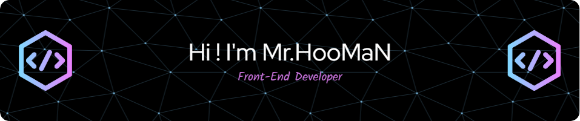

### 💫 About Me:

I'm a Front-End Developer who enjoys building things that live on the internet. I enjoy constantly learning and improving my skills with the many technologies that power the web.

#### 🌍 I'm based in Kurdistan, Iran ✉️ You can contact me at eng.homan@gmail.com

## 💻 I Code With:

    

   

## 🖥️ Technologies I'm Familiar With:

  

  

 

   
